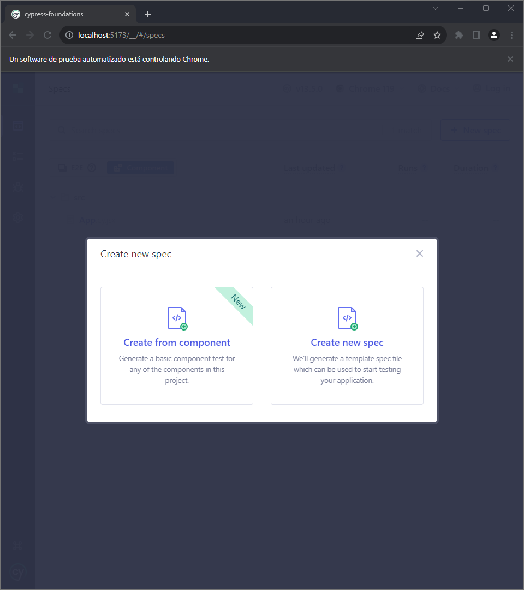
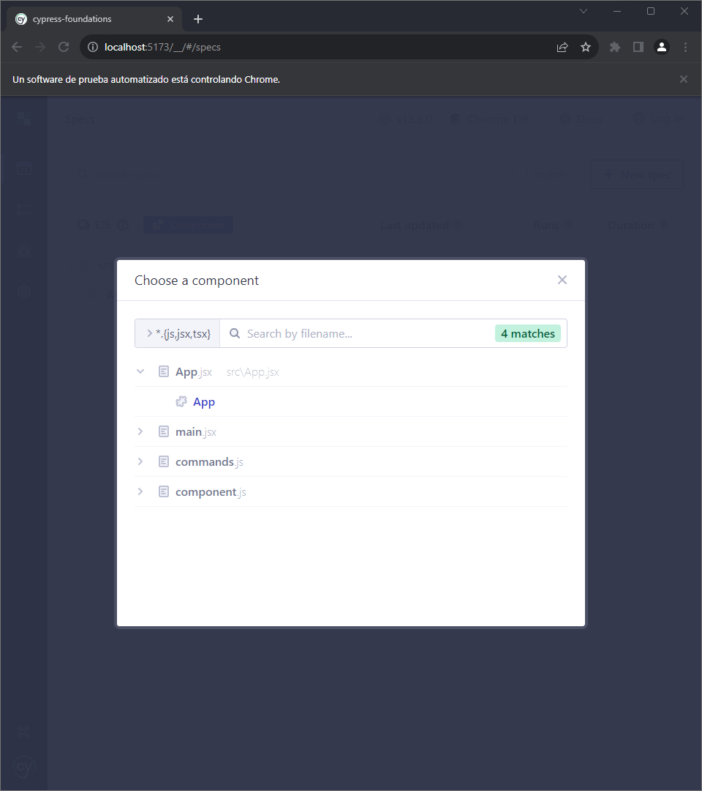
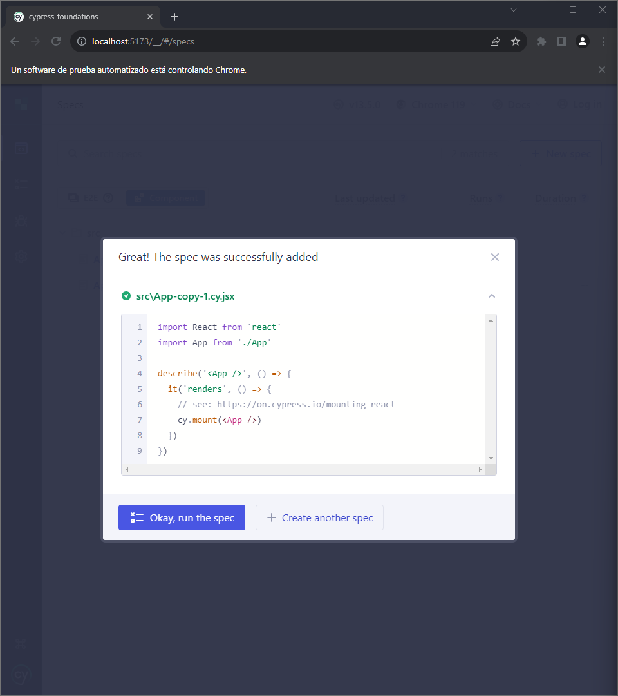
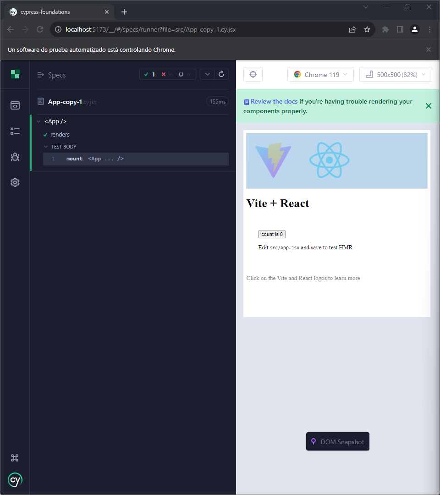
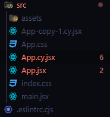
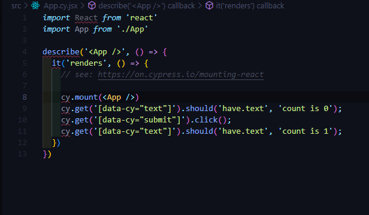

# Components Tests

## Crear pruebas

Para crear una prueba para un componentes se selecciona la opción correspondiente.

Seleccionamos el componente al cual se le desea crear la prueba.

Dependiendo de lo que se desee, se selecciona utilizar un plantilla predeterminada o crear una nueva.

Se selecciona cualquiera de las dos opciones y la prueba ya se puede ejecutar.

El archivo que contiene la prueba tiene la extesión *.cy* y se encuentra en el mismo directorio que el componente.

## Estructura

### **describe** 
Es la función principal donde irán todas las pruebas que se le realizarán el componente.

Recibe dos parametros:
- El nombre de conjunto de las pruebas.
- La función que ejecuta las pruebas.

### **it**
La función representa una prueba individual. Esta función recibe dos parametros:
- El nombre de la prueba individual
- El codigo para realizar la prueba

## Cuerpo de la función

### **cy.mount**

La función cy.mount() es la primera a ejecutar, ya que está verifica si el componente ha sido correctamente montado y, por consecuencia, se pueden realizar las pruebas.

Esta función recibe como parameotr el componente.

### **cy.get**
Una vez comprobado que el componente se ha montado, se pueden realizar más testeos.

El método cy.get selecciona el elemento con el que se quiere realizar la prueba.

Este método recibe el elemento con el que se desea trabajar.

> Como consejo para tener un orden de los elementos a seleccionar, se recomienda poner un identificador al elemento HTML.
>
`
{count}
`

Una vez seleccionado el elemento se pueden realizar diferente acciones dependiendo la naturaleza.

[https://docs.cypress.io/guides/references/best-practices#Selecting-Elements]

[https://docs.cypress.io/guides/core-concepts/introduction-to-cypress]

[https://www.browserstack.com/guide/cypress-unit-testing]