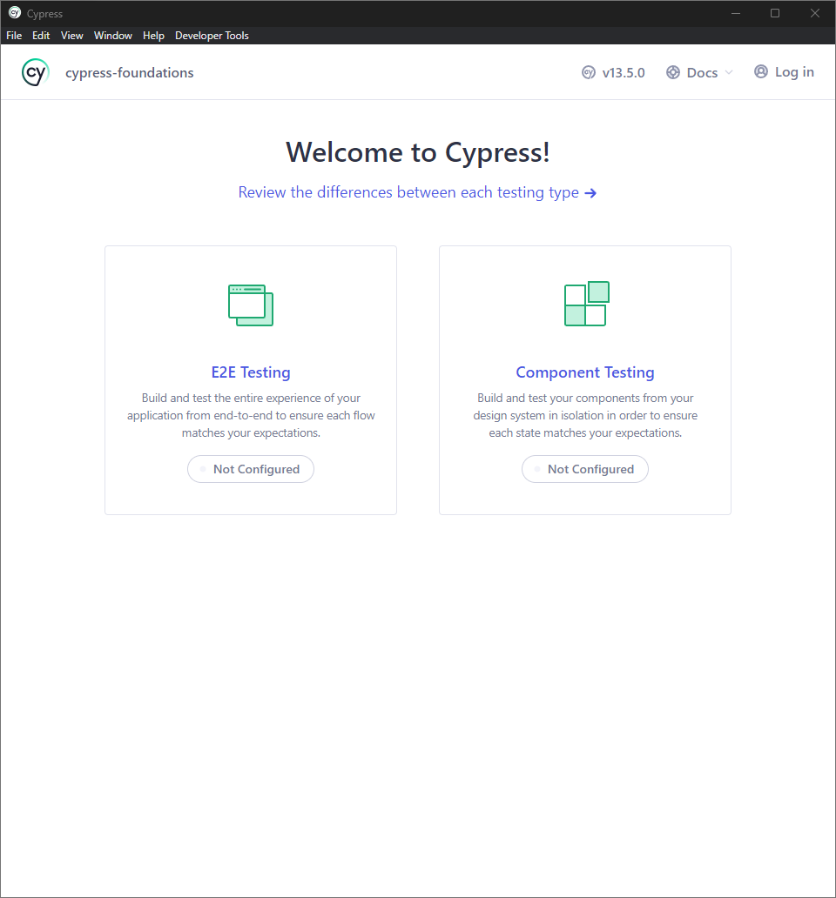
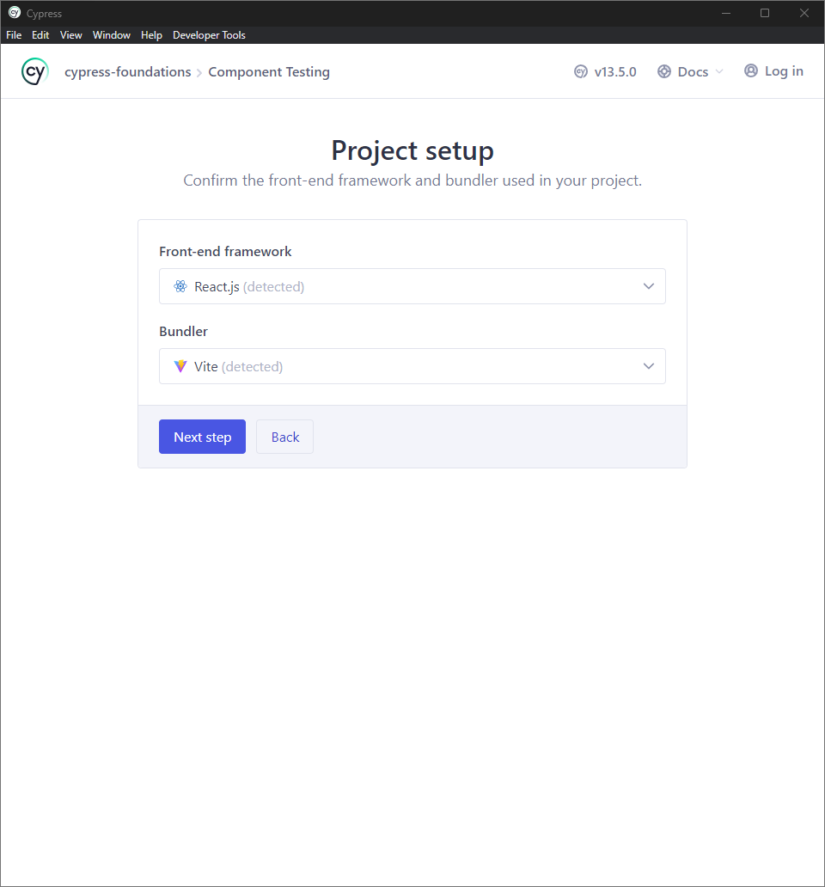
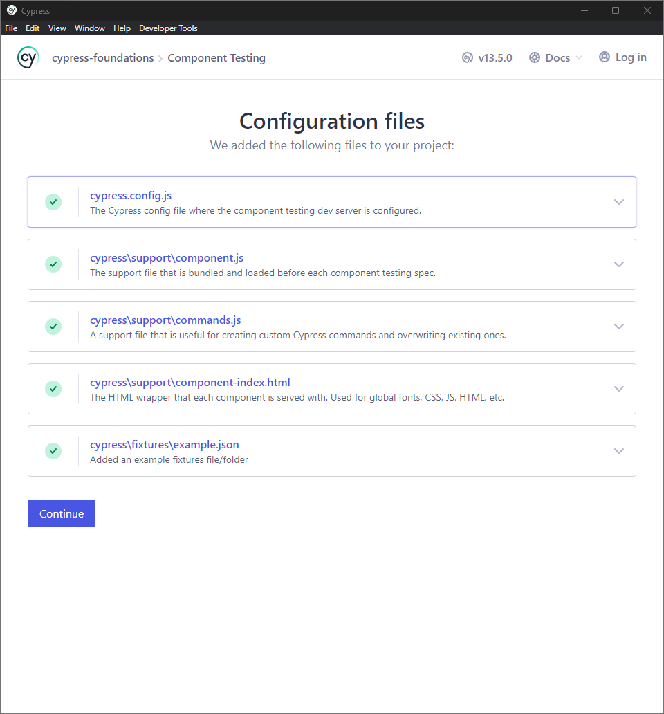
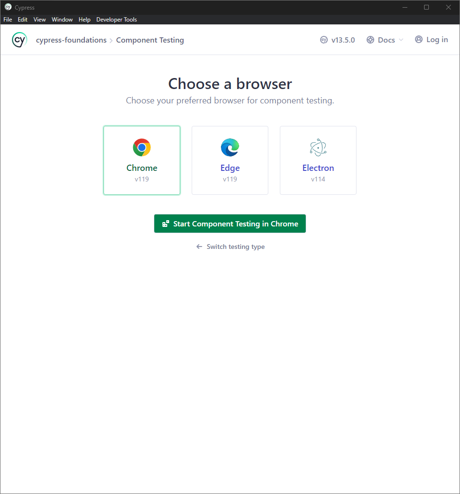
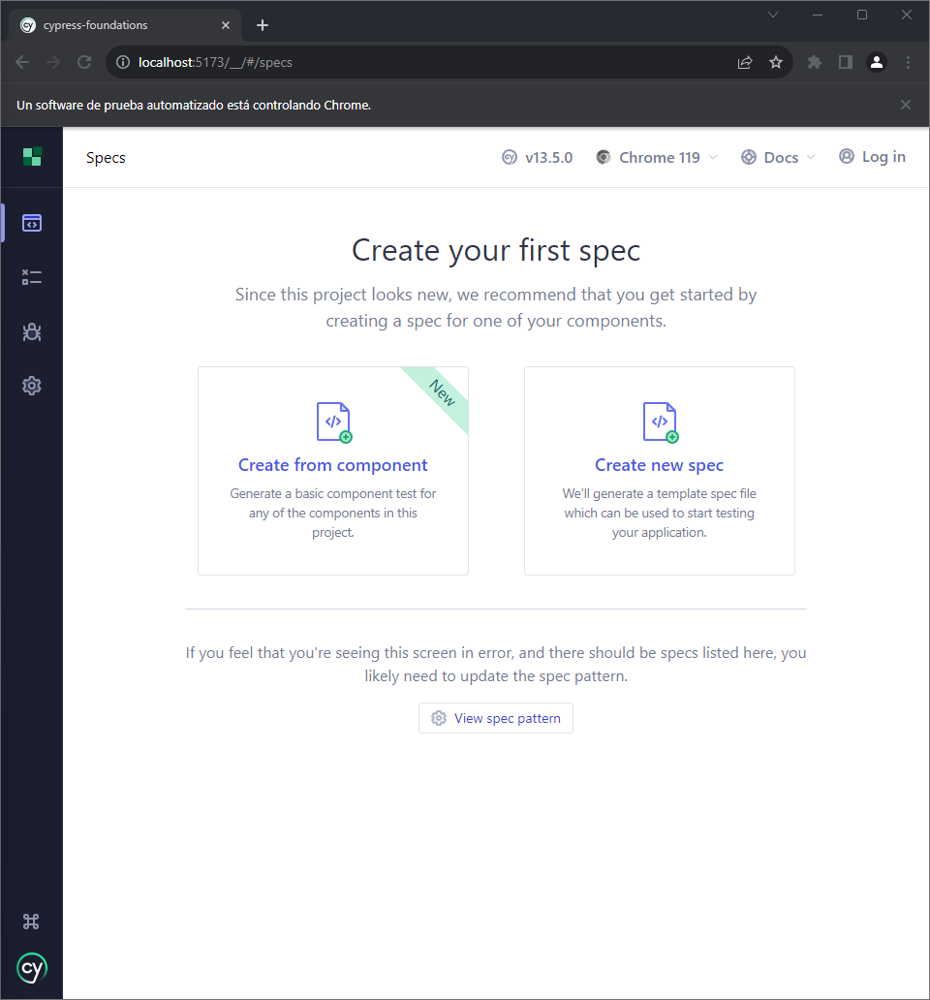

# Ejemplo

Una vez instaladas las dependencias en el proyecto, se procede a abrir la aplicación.

La aplicación nos muestra el tipo de testeo que deseamos realizar (E2E o Components).

Seleccionamos el framework y la herramienta de compilación.

Verificamos que las dependencias y las configuraciones sean correctas.

Seleccionamos el navegador a usar.

Una vez terminada toda la configuración, se procede a escribir las primeras pruebas.

## Tipos de pruebas
- Components [Link](Components.md)