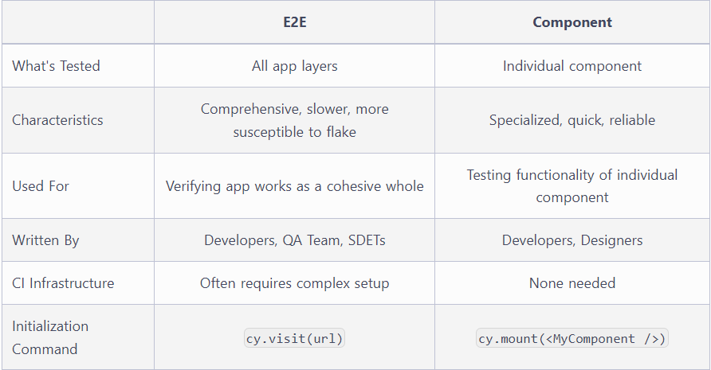

# Tipos de tests

Cuando se deciden empezar a crear pruebas se tiene que decidir que tipo de pruebas realizar.

## E2E (End-to-End)

Este tipo de pruebas están diseñadas para probar la aplicación desde el navegador hasta el back-end, al igual que mediante API de terceros y otros servicios. Este tipo de pruebas son muy convenientes para cuando **se quiere estar seguro de que las aplicación funciona completamente**.

Cypress ejecuta E2E test de las misma manera en que los usuarios interactuan con la aplicación usando un navegador, visitando URL's, visaulizando contenido, haciendo clicks, etc.

Este tipo de pruebas la pueden realizar desarrolladores, equipos de QA, entre otros.

Este tipo de pruebas son ideales para verificar el correcto funcionamiento de la aplicación, pero son más complejas de configurar, ejecutar y mantener.

## Components

Adaptado a los frameworks modernos y su forma de trabajo, los componentes tiende a ser faciles de testear.

El testeo por componentes difiere del E2E ya que en vez de visitar una URL y montar una aplicación completa, un componente puede montarse y probarse a él solamente. Esto permite enfocarse solo en el testeo de la funcionalidad del componente y no preocuparse por otros problemas.

Los testeo por componentes son sencillos ya que el mismo codigo puede vivir en el mismo lugar que el del componente. Sin embargo,**el pasar todas las pruebas del componente no significa que la aplicación funcionará correctamente**.

## Tabla comparativa

[LINK DOCUMENTACIÓN DE LA SECCION](
https://docs.cypress.io/guides/core-concepts/testing-types)
